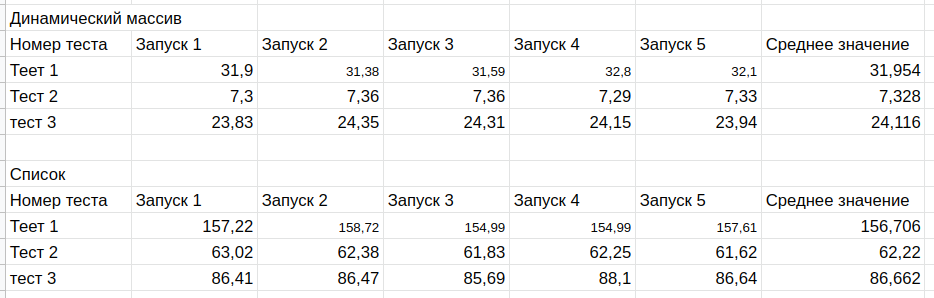

#Сравнение времени работы структуры данных stack 

## Динамический массив
В первм случае стэк был реализован с помощью динамического массива. На нем были возможны операции ctor, dtor, push, pop, back. Реаллоцирование памяти происходило только в большую сторону.

## Односвязный список
Во втором случае стэк был реализован с помощью односвязного списка. На нем были возможны операции ctor, dtor, push, pop, back. При добавлении элемента в stack каждый раз выделялась память, а при удалении память освобождалась.

##Примеры 
По ссылке ниже вы можите ознакомится с полным условие задачи и тестам, на которых тестировались реализации.

https://github.com/VladislavHacker/MiptExamples/blob/main/2023/AlgoICT2Sem/Practics/Prac2/README.md

#Вывод 
Stack реализованный на динамическом списке работает гораздо быстрее, чем реализация с помощью односвязного списка

